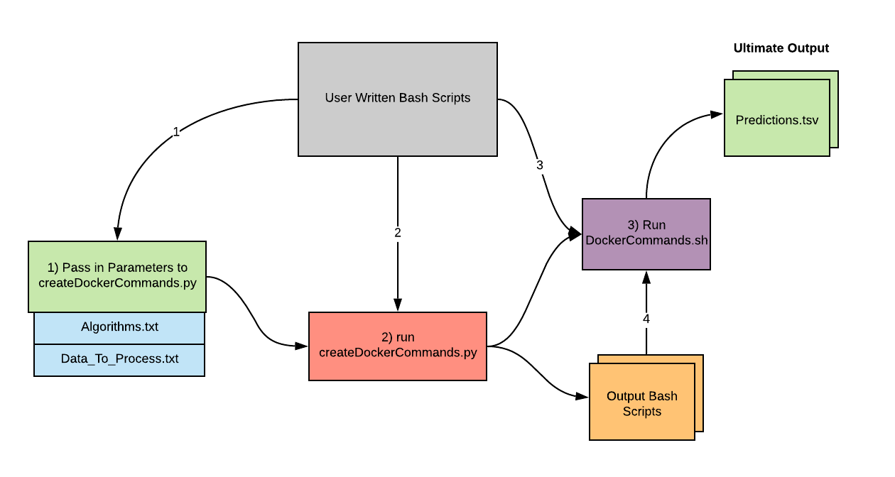
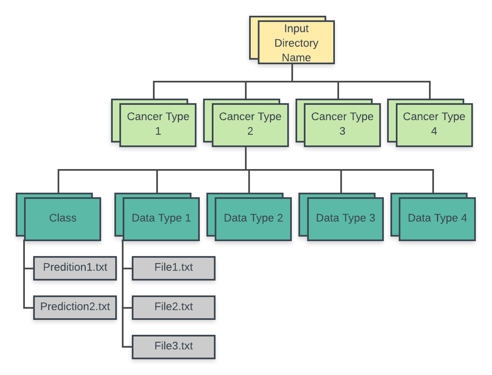

# DataTypesAnalysis
This repository contains code for using multiple molecular datatypes with multiple machine learning algorithms for predicting cancer patient outcomes (PFI, OS, DSS, DFI).
It uses another repository called ShinyLearner as well as docker in order to execute.

This README.md will discuss this 3 things: 1) What this repository does, 2) how to use this repository, and 3) how it works

1) This repository allows users to test different machine learning algorithms with different datatypes (and all the different combinations) in order to determine which datatype works best with which machine learning algorithm. It essentially builds a bash script for every cancertype, datatype, machine learning algorithm, and iteration that the user would like to evaluate. Then it builds a file to run each of those bash scripts.

2) In order to run this repository a user must write a bash script that does three things:
    1) Passes in the necessary parameters to a file called createDockerCommands.py
    2) Runs createDockerCommands.py
    3) Runs run the output file of createDockerCommands.py (the default is Docker_Commands.sh)
    
   See diagram below for visual representation
  

  For an example please click of a user written bash script click [here](https://github.com/natemella/DataTypesAnalysis/blob/master/Extra/Examples/exe_analysis_example)
  
  In order to run createDockerCommands.py, you will need to build an Algorithms.txt file
  and a Data_To_Process.txt file. These two files should contain all of the algorithms and
  datatypes that you would like to use in your analysis.
    
  *For an example of an Algorithms.txt file, click [here](https://github.com/natemella/DataTypesAnalysis/blob/master/Extra/Examples/Algorithms.example.txt):
  
  *For an example of a Data_To_Process.txt file, click [here](https://github.com/natemella/DataTypesAnalysis/blob/master/Extra/Examples/Data_To_Process.example.txt)
  
  The Data_To_Process.txt file should contain in column 1 (Cancer Type) column 2 (Name of Class File that the user would like to predict) columns 3 and on (The names of the files under the data_type that they would like to use)
  
   You will also need your data stored on your computer in an organized way so that this repository can grab it. 
  See the flow chart  below to understand how this repository expects the data to be stored.
  
  
  While running createDockerCommands.py, be sure to include the following parameters:
  
      sys.argv[1] = The name of your analysis
      sys.argv[2] = The path to your data_to_process_file
        
  Optional parameters include:
  
        -s START_ITERATION (default = 1)
        -e STOP_ITERATION (default = 1)
        -m MEMORY_GIGS (default = 100)
        -w SWAP_MEMORY_GIGS (default = 100)
        -t HOURS_MAX (default = 4) 
        -c CORES (default = 1)
        -a ALGORITHMS_PATH (default = "Algorithms.txt")
        -x CHECK_FILE (default = "Predictions.tsv")
        -o OUTFILE (default = "Docker_Commands.sh")
        -l SHINY_LEARNER_VERSION (default = 513)
        --scale-mode SCALE_MODE (default = "True")
        -u OUTER_FOLDS (default = 10)
        -i INNER_FOLDS (default = 5)

  *Your InputData directory should be located in your current working directory
  
3) This repository functions mainly through createDockerCommands.py
   createDockerCommands.py does 5 main things:
    1) It parses the algorithms file to find all the possilbe algorithms for the analysis
    2) It finds all the possible data combinations to process
    3) It checks to see if any of the anaylsis have already been done. If so it will not repeat the analysis
    4) Execute the anaylsis for each combination of dataset, algorith and iteration (through building bash scripts)
    5) Create a file that indicates the location of all the bash scripts that need to be executed
    
 

