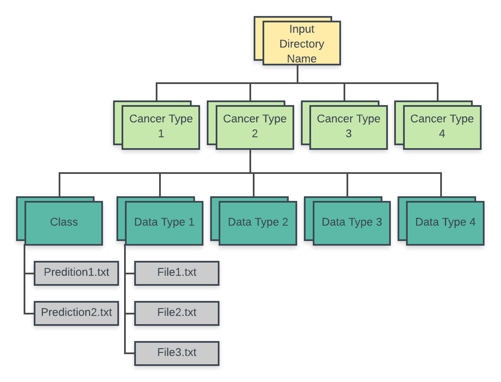

# DataTypesAnalysis
This repository contains code for analyzing multiple datatypes with multiple machine learning algorithms.
It uses another repository called ShinyLearner as well as docker in order to execute.

This README.md will discuss this 3 things: 1) What this repository does, 2) how to use this repository, and 3) how it works

1) This repository allows users to test different machine learning algorithms with different datatypes (and all the different combinations) in order to determine which datatype works best with which machine learning algorithm.

2) In order to run this repository a user must write a bash script that does three things:
    - 1) Passes in the necessary parameters to a file called createDockerCommands.py
    - 2) Runs createDockerCommands.py
    - 3) Runs DockerCommands.sh (a file generated by the python script)
  
  For an example please click [here](https://github.com/natemella/DataTypesAnalysis/blob/master/exe_analysis_example)
  
  In order to run createDockerCommands.py, you will need to build an Algorithms.txt file
  and a Data_To_Process.txt file. These two files should contain all of the algorithms and
  datatypes that you would like to use in your analysis.
    
  *For an example of an Algorithms.txt file, click [here](https://github.com/natemella/DataTypesAnalysis/blob/master/Algorithms.example.txt):
  
  *For an example of a Data_To_Process.txt file, click [here](https://github.com/DataTypesAnalysis/edit/master/Data_To_Process.txt)
  
  While running createDockerCommands.py, be sure to include the following parameters:
    - analysis_name = sys.argv[1]
    - startIteration = int(sys.argv[2])
    - stopIteration = int(sys.argv[3])
    - memoryGigs = sys.argv[4]
    - swapMemoryGigs = sys.argv[5]
    - hoursMax = sys.argv[6]
    - numCores = sys.argv[7]
    - algorithmsFilePath = sys.argv[8]
    - dataToProcessFilePath = sys.argv[9]
    - outFileToCheck = sys.argv[10]
    - dockerOutFilePath = sys.argv[11]
    - shinyLearnerVersion = sys.argv[12]
    - datatype_directory = sys.argv[13]

  You will also need your data stored on your computer in an organized way so that this repository can grab it. 
  See the flow chart  below to understand how this repository expects the data to be stored.
  

  *Your InputData directory should be located in your current working directory
  
3) This repository functions mainly through createDockerCommands.py
   createDockerCommands.py does 5 main things:
    - 1) It parses the algorithms file to find all the possilbe algorithms for the analysis
    - 2) It finds all the possible data combinations to process
    - 3) It checks to see if any of the anaylsis have already been done. If so it will not repeat the analysis
    - 4) Execute the anaylsis for each combination of dataset, algorith and iteration (through building bash scripts)
    - 5) Create a file that indicates the location of all the bash scripts that need to be executed
    
  See diagram below for visual representation
  

